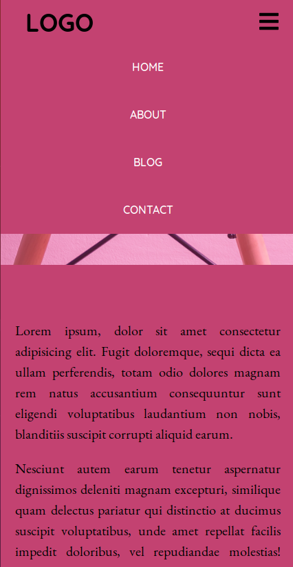
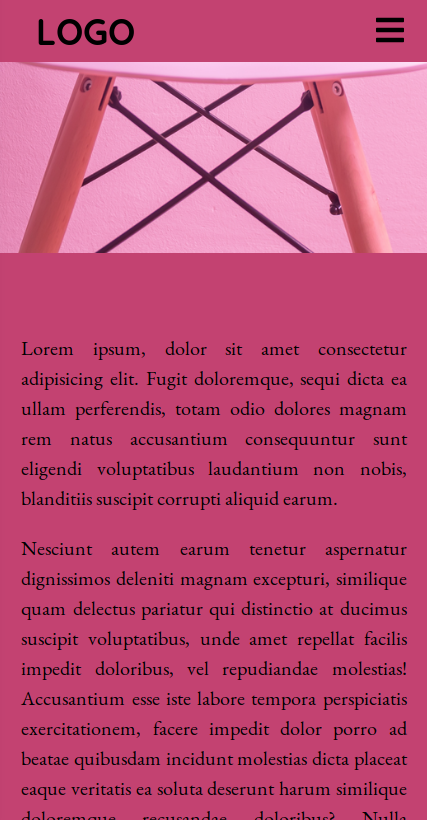

# Responsive-sticky-navbar
- This repositiry contains a responsive navigation menu
- A Dropdown menu appears at mobile screen size
- A Horizontal navigation bar appears at desktop screen size
- A JQuery scrolling effect takes place on scrollTop
## Folders and Files
- CSS folder contains styles.css file for the styles
- img folder contains image files
- index.html-entry point file
- README.md
## Links
[See website here!](https://dulanjaleefl.github.io/Responsive-sticky-navbar/)
## Build with
- HTML
- CSS
- JavaScript
- JQuery
## Screenshots

